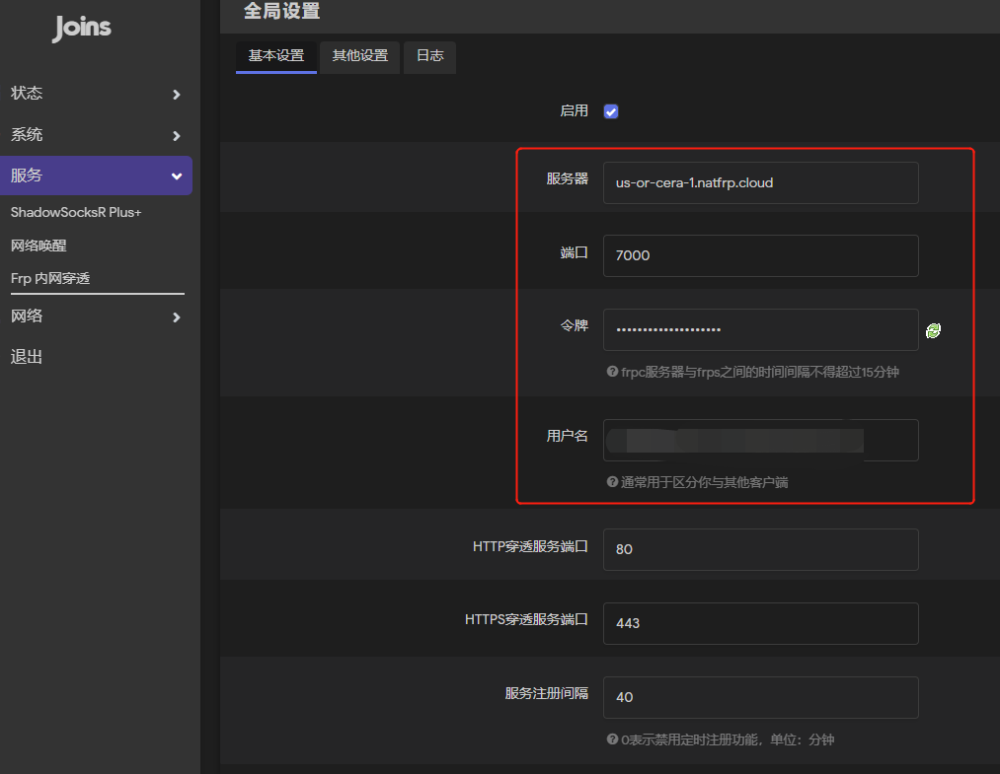
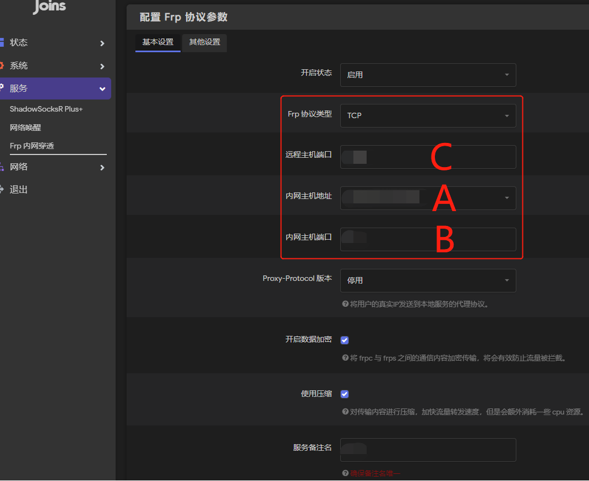
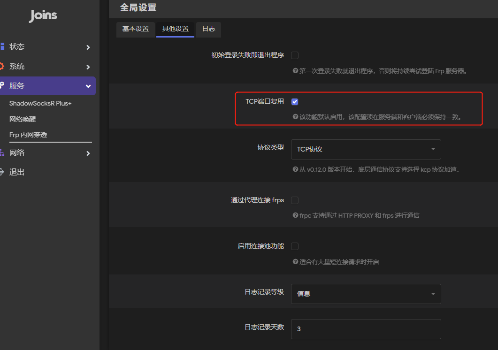
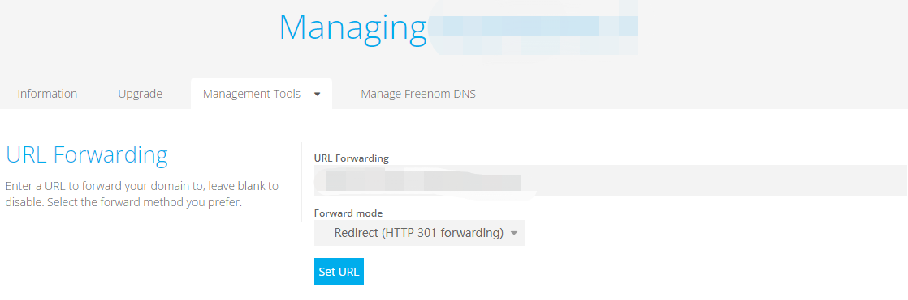

## Frp内网穿透

**免责声明：**

* **有公网IP的可以跳过本篇教程，自行端口映射；无公网IP的往下看**
* **内网穿透实现有很多种方式，本文只探讨Frp内网穿透**
* **本人属于白嫖党，偏向于研究如何白嫖或者花很少的钱办很多的事情**
* **本文仅限提供给想个人捣鼓，或者有geek精神的人**
* **本文不做技术层面的探究，涉及到相关技术请自行百度学习；本文只详实记述过程步骤**
* **本文旨在提供其中一种白嫖和花费较少的方式，不排除有更方便，更安全，速度更快，更白嫖的方式，请勿抖机灵**

### 一、内部条件
* 你需要一台已刷openwrt（或其他软路由）固件的路由器
* 在软路由系统中安装Frp内网穿透插件（固件自带了Frp插件可不用再安装）

### 二、外部条件
* Frps（Frp服务端），聪明的小伙伴就要问那就有Frp客户端了，没错，Frp客户端就是第一大点中提到的你在软路由系统中装的Frp插件！
* 域名（这条可以不用）

### 三、为什么需要花钱
#### 1. 路由器或其他可刷软路由的设备
这部分花费必不可少
#### 2. Frps的搭建，意味着你必须有一台全天在跑的机器用于部署Frp服务端
需要买云服务器或者设备自己搭建；你也可以直接买内网穿透服务，无论怎么说都是要花钱的！
#### 3. 域名
可以不需要；需要的话还是得去云服务厂商购买，国内的必须提供备案等等；花钱+麻烦

### 四、如何省钱
* Sakurafrp - 一家提供内网穿透服务的平台，当前有免费的套餐和节点选择（每天签到可以增加流量）
* Freenom - 提供免费的域名，但是后缀相对来说不太好（能用就好）

### 五、Sakura Frp
**自行注册下账号即可**：[SakuraFrp](https://www.natfrp.com/)

SakuraFrp官方还讲了内网穿透的基本知识，可以一看：[内网穿透的基本知识](https://doc.natfrp.com/#/basics)
#### 1. 首页

如上图，首页每天签到增加流量，基本够用

#### 2. 新建隧道

如上图：
* 选择 穿透 -> 新建隧道 (免费玩家目前最多可创建2个隧道)
* 在弹出框里，自行选择服务器节点（分国内和国外，推荐国外；国内一般需要网站自身实名认证（需要花费1元钱即可，这也可能是唯一需要花钱的地方了），当然你如果有建站需求还得需要备案，那就比较麻烦）
* 隧道类型根据自己选择而定（TCP/UDP/HTTP等）
* 必填的本地IP：你需要穿透的服务IP
* 必填的本地端口：你需要穿透的服务的端口
* 远程端口：代表创建隧道后，Frps对应的服务端口
* 自动HTTPS：推荐选择自动（中国内地节点不允许直接通过 TCP 隧道转发明文 HTTP 流量，您可以配置 frpc 并将 HTTP 服务自动转换为 HTTPS 服务；海外节点好像还未做要求）
* **其他不明白的可自行查阅SakuraFrp官方文档，很详细**

#### 3. 隧道详细

**你可以点击最后一列的操作->查看配置文件（你所需要的配置都在其中，也可以随时更改）**

#### 4. 对在Openwrt的Frp插件进行配置
将框中的部分配置设置与隧道的配置文件中的配置一致即可

**最后在Frp的日志中看到[start proxy success]或者[隧道启动成功]的提示，那么基本上就成功了**

### 六、域名
**自行注册下账号即可**：[Freenom](https://my.freenom.com/)

根据网站指引自行搜索，找到一个免费的域名直接加入购物篮确认即可

免费的策略：好像第一次可以选择最长1年free，后续是否可以免费续未知；如果不行，顶多再申请一个免费的域名，配置下就行了

#### 1. 为什么需要域名
我们又不要建站，为啥需要域名；其次，真要建站，现在申请+备案整个流程下来都得脱层皮

这里我们要域名只是为了记忆方便（你可以看到SakuraFrp提供的服务域名太长了，甚至好几级子域名，根本不利于记忆）：us-or-cera-1.natfrp.cloud，就这个域名记清楚都得半天，而且你还得记住服务端口号

下面是我申请域名之后的页面，配置一下Url重定向，采用永久重定向方式

Url Forwarding：SakuraFrp服务域名：[远程端口]

至此大功告成！在浏览器地址栏输入你的域名地址即可访问你的内网服务啦...